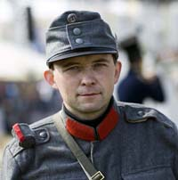

Serg Kobrusev
============ 
### Mechanical Engineer

+ Tel: +375-29-3624534

+ Email: skobrusev446@gmail.com

+ Adress: Belarus, Barysau

+ Website: [http:/bka.ucoz.ru](http:/bka.ucoz.ru) & [http:/22pp.ucoz.net](http:/22pp.ucoz.net)
          

Hello ! I`m Serg Kobrusev.
-------------------------
Chartered Mechanical Engineer, Bachelor of Engineering Science with over 20 years experience, specializing in special vehicle design.

In addition to designing cars using tools such as Autocad, Solidworks, UG, Creo, Adams, Patran, I took part in the development of programs in the Delphi language for solving applied engineering problems at the Minsk Automobile Plant.

Now I have decided to change my profession and join the entire IT community. In the future, I want to connect my life with the development of web applications.

**My Skills**
-------------

* Now I am learing HTML, CSS, JavaScript and English on my own.

* My level of knowledge in JavaScript at the moment according to the training platform [www.codewars.com](www.codewars.com) (SergOswald): [My JavaScript Skilles](https://www.codewars.com/users/SergOswald/stats).
